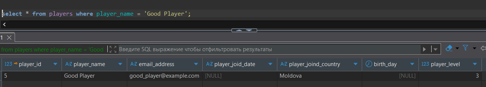
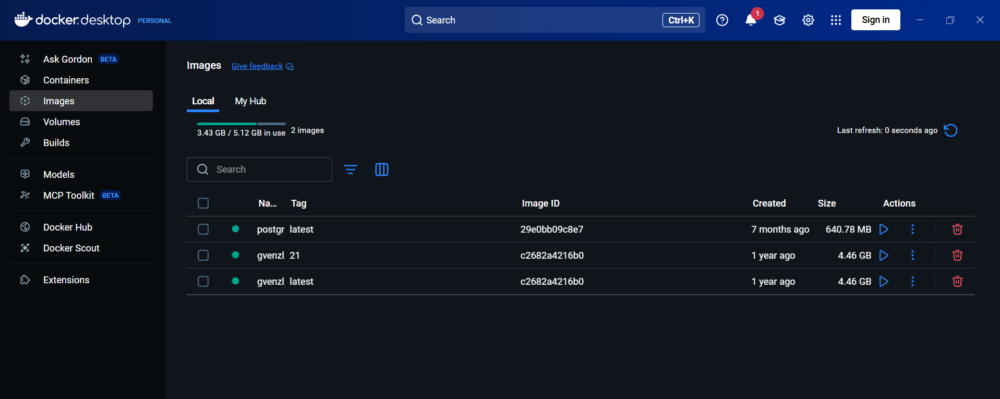
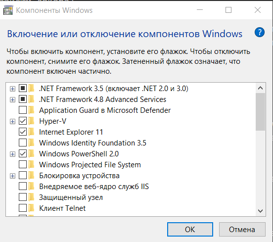
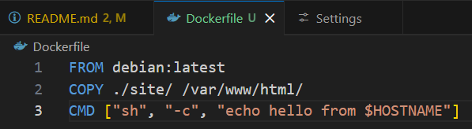
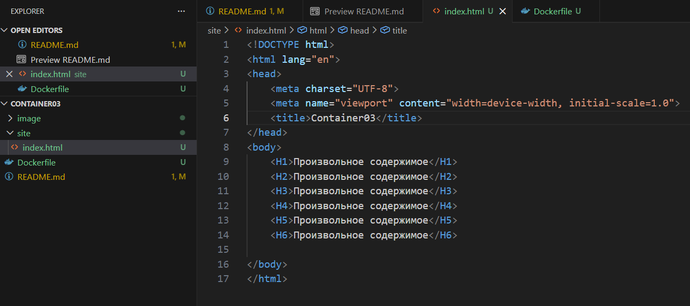

# Лабораторная работа N3

## Цель работы

Ознакомиться с основами контейнеризации а также подготовить рабочее пространство для дальнейших лабораторных работ.

## Ход работы

> Установить Docker Desktop и проверить его работоспособность.

Docker Desktop был давно установлен и протестирован, ошибок не наблюдалось, хотел написать я, однако впервые за всё время при запуске docker engine появилась ошибка.

```cmd

running wslexec: An error occurred while running the command. Wsl/Service/RegisterDistro/CreateVm/HCS/0x800705aa: c:\windows\system32\wsl.exe --import docker-desktop <home>\appdata\local\docker\wsl\main c:\program files\docker\docker\resources\wsl\wsl-bootstrap.tar --version 2: exit status 0xffffffff

```

Решить данную проблему получилось через 3 команды в Power Shell:

- ```wsl --shutdown``` - полностью останавливает "windows subsystem for linux"
- `wsl --unregister docker-desktop` - удаление дистрибутива docker desktop из wls
- ```wsl --unregister docker-desktop-data``` - удаляет все данные (образов, контейнеров и вэйлюм докера)

После перезапуска системы и docker desktop был сделан экспериментальный запрос в старой учебной безе данных на postgresql. Как видим, всё работает.





P.S. В конечном итоге это сработало лишь один раз, основная проблема была в отключённым Hyper -V который произвольно отключился в "Компонентах windows"



> Создайте в папке containers03 файл Dockerfile со следующим содержимым:



> В той же папке проекта создайте папку site. В новой папке создайте файл index.html с произвольным содержимым.



> Откройте терминал в папке containers03 и выполните команду: `docker build -t containers03 .`

`docker build -t containers03 .` - создаём образ с именем контейнер

> Сколько времени создавался образ?

`Building 14.9s (7/7) FINISHED`

> Выполните команду для запуска контейнера: `docker run --name containers03 containers03`

В консоль вывелось: `hello from 93a4ad44e3cc`

> Удалите контейнер и запустите снова, выполнив команды:

`docker rm containers03` - удаляем контейнер *containers03*
`docker run -ti --name containers03 containers03 bash` - запускает контейнер с рабочим терминалом контейнера


> В открывшемся окне выполните команды:
>
> ```
> cd /var/www/html/
> ls -l
> ```

```
total 4
-rwxr-xr-x 1 root root 574 Feb 26 08:11 index.html
```

Таким оразом, мы видим что в контейнер копировался сайт `index.html` который мы создали в папке sites.

## Выводы

В данной лабораторной работе мы познакомились с основами создания контейнеров в docker. Научились писать базовый dockerfile, который не только выводит сообщение в консоль, но и также, копирует в образ контейнера части текущего проекта. Данные знания помогут в дальнейшем более углублённо понять принципы работы контейнеров.

## Источники

- [Решение проблем с docker через power shell](https://www.reddit.com/r/docker/comments/1ft6u6f/docker_desktop_unexpected_wsl_error/)
- [Инструкция по лабораторной работе](https://elearning.usm.md/mod/quiz/view.php?id=303622)
